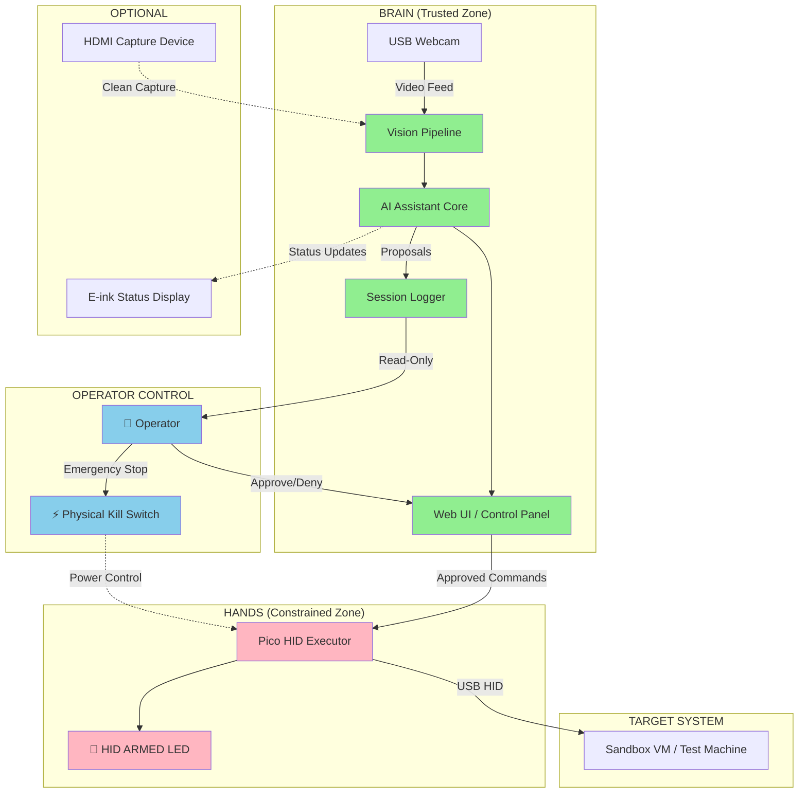
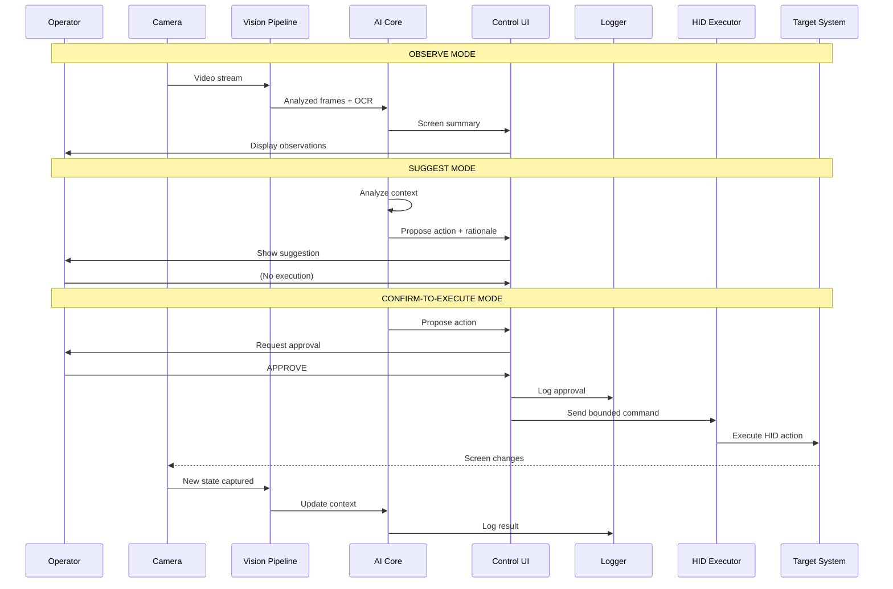
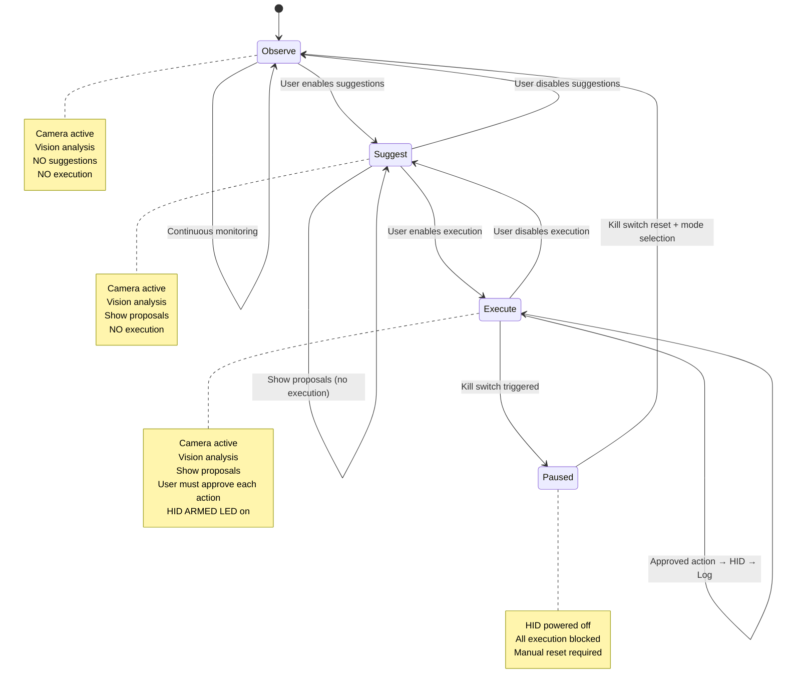

# System Architecture — HexForge PLA

## Overview

HexForge PLA follows a **"Smart Brain, Dumb Hands"** architecture with strict trust boundaries and explicit user approval gates.

## Component Architecture



## Trust Boundaries

```
┌─────────────────────────────────────────────────────────────┐
│  OPERATOR CONTROL LAYER                                      │
│  - Physical kill switch                                      │
│  - Approve/deny interface                                    │
│  - Session monitoring                                        │
└─────────────────────────────────────────────────────────────┘
                             │
                             ▼
┌─────────────────────────────────────────────────────────────┐
│  TRUSTED ZONE (Brain)                                        │
│  ┌─────────────────────────────────────────────────────┐    │
│  │  Vision → Analysis → Reasoning → Proposal           │    │
│  │  All AI logic, OCR, context awareness               │    │
│  │  NO direct HID access                               │    │
│  └─────────────────────────────────────────────────────┘    │
└─────────────────────────────────────────────────────────────┘
                             │
                    (Approval Gate)
                             │
                             ▼
┌─────────────────────────────────────────────────────────────┐
│  CONSTRAINED ZONE (Hands)                                    │
│  ┌─────────────────────────────────────────────────────┐    │
│  │  Dumb HID Executor                                   │    │
│  │  - Receives bounded commands only                    │    │
│  │  - No reasoning or autonomy                          │    │
│  │  - Rate limited                                      │    │
│  │  - Kill switch interrupt                             │    │
│  └─────────────────────────────────────────────────────┘    │
└─────────────────────────────────────────────────────────────┘
                             │
                             ▼
┌─────────────────────────────────────────────────────────────┐
│  TARGET SYSTEM (Sandbox)                                     │
│  - Test VM (Windows/Linux)                                   │
│  - Operator-owned machines only                              │
└─────────────────────────────────────────────────────────────┘
```

## Data Flow Diagram



## Mode State Machine



## Hardware Communication Protocol

**All communication uses validated JSON contracts (v1).**  
See [Contracts Index](../contracts/CONTRACTS_INDEX.md) for full specifications.

### Brain → HID Executor: Action Execute (v1 Contract)

```json
{
  "execution_id": "uuid-v4",
  "proposal_id": "uuid-v4",
  "timestamp": "ISO-8601",
  "mode": "EXECUTE",
  "action_type": "TYPE_TEXT" | "KEY_COMBO" | "MOUSE_MOVE" | "MOUSE_CLICK",
  "payload": {
    "text": "bounded string max 1024 chars",
    "keys": ["ctrl", "alt", "t"],
    "x": -1000 to 5000,
    "y": -1000 to 5000,
    "button": "left" | "right" | "middle"
  },
  "safety_bounds": {
    "max_text_length": 1024,
    "min_action_delay_ms": 100
  },
  "operator_approval": {
    "decision_timestamp": "ISO-8601",
    "operator_id": "string"
  }
}
```

**Contract Enforcement**: HID executor validates all fields against schema before execution.  
**Schema**: `contracts/schemas/action_execute.schema.json`

### HID Executor → Brain: Device Status (v1 Contract)

```json
{
  "device_id": "pico_w_serial",
  "timestamp": "ISO-8601",
  "mode": "OBSERVE" | "SUGGEST" | "EXECUTE",
  "led_state": true | false,
  "kill_switch_state": "ARMED" | "DISABLED" | "UNKNOWN",
  "uptime_seconds": 3600,
  "error_state": {
    "has_error": false,
    "error_code": "NONE"
  }
}
```

**Schema**: `contracts/schemas/device_status.schema.json`

### Legacy Protocol (Backward Compatible)

Simple command format (deprecated, use contracts for new development):

```json
{
  "action_id": "uuid-v4",
  "timestamp": "ISO-8601",
  "type": "TYPE_TEXT" | "PRESS_KEYS" | "MOUSE_MOVE" | "MOUSE_CLICK",
  "payload": {
    "text": "bounded string max 1024 chars",
    "keys": ["CTRL", "ALT", "T"],
    "x": 0-65535,
    "y": 0-65535,
    "button": "LEFT" | "RIGHT" | "MIDDLE"
  },
  "constraints": {
    "max_delay_ms": 5000,
    "require_ack": true
  }
}
```

### HID Executor → Brain Response Format (Legacy)

```json
{
  "action_id": "uuid-v4",
  "status": "SUCCESS" | "REJECTED" | "TIMEOUT" | "KILLED",
  "timestamp": "ISO-8601",
  "details": "Human-readable status"
}
```

## Physical Layout Options

### Option A: Portable Lab Cart

```
┌─────────────────────────────────────┐
│  Monitor (Brain UI)                 │
│  ┌───────────────────────────────┐  │
│  │   Live Feed | Suggestions    │  │
│  │   [ APPROVE ] [ DENY ]        │  │
│  └───────────────────────────────┘  │
├─────────────────────────────────────┤
│  Webcam (adjustable mount)          │
│         ⬇️                           │
│  [Target System Monitor]            │
├─────────────────────────────────────┤
│  Shelf:                             │
│   • Brain (RPi4 or mini PC)         │
│   • E-ink Status Display            │
│   • 🔴 KILL SWITCH 🔴                │
├─────────────────────────────────────┤
│  USB Hub → Target System            │
│   • HID Executor (Pico W)           │
│   • LED: HID ARMED indicator        │
└─────────────────────────────────────┘
```

### Option B: VM Brain + Portable HID

```
Proxmox Host VM (Brain)
    ↕️ Network
[Control Laptop/Tablet]
    ↕️ USB
[Pico W HID Executor] → [Target System]
         │
    [Kill Switch]
```

## Component Responsibilities

### Brain (Trusted)
- **Vision Pipeline**: Frame capture, OCR, scene understanding
- **AI Core**: Context analysis, proposal generation, reasoning
- **Control UI**: Operator interface, approve/deny workflow
- **Session Logger**: Immutable audit log (proposals, decisions, outcomes)

**Constraints**:
- NO direct HID device access
- NO autonomous execution
- All proposals require approval

### HID Executor (Constrained)
- **Command Parser**: Validates incoming commands against bounds
- **HID Driver**: Sends USB HID reports to target system
- **Safety Monitor**: Enforces rate limits, kill switch interrupt

**Constraints**:
- Command length: max 1024 chars per action
- Rate limit: max 1 action per 100ms
- NO persistent state
- NO reasoning logic
- Kill switch instantly powers off device

### Optional Status Display
- Shows current mode (Observe/Suggest/Execute)
- Shows HID armed state
- Shows last action timestamp
- Read-only; no control interface

## Network Architecture (VM Brain Option)

```
┌────────────────────────────────────────────────────┐
│  Proxmox Host                                      │
│  ┌──────────────────────────────────────────────┐ │
│  │  Brain VM (Linux)                            │ │
│  │  - Web UI (localhost or LAN only)            │ │
│  │  - AI inference engine                       │ │
│  │  - USB camera passthrough                    │ │
│  │  - Serial/Network to HID executor            │ │
│  └──────────────────────────────────────────────┘ │
└────────────────────────────────────────────────────┘
           │                           │
    [Control Tablet]            [HID Executor via Network]
  (Web UI, LAN access)          (or USB serial passthrough)
```

## Safety Stack

```
Layer 1: Physical Kill Switch
         ↓ (Power interrupt to HID executor)

Layer 2: Operator Approval Gate
         ↓ (UI confirm button)

Layer 3: Command Bounds Validation
         ↓ (Length, rate, type checks)

Layer 4: HID Executor Safety Monitor
         ↓ (Rate limiter, watchdog)

Layer 5: Session Logging
         ↓ (Immutable audit trail)
```

## Deployment Assumptions

1. **Brain Host**: Raspberry Pi 4 (4GB+) or Proxmox VM (2 vCPU, 4GB RAM, 20GB disk)
2. **Network**: Local LAN for web UI access (no internet required)
3. **Target Systems**: Windows 10/11 or Linux VMs with USB HID support
4. **Storage**: 50GB+ for session logs, video captures (if retained)
5. **Power**: UPS recommended for lab stability

## Design Rationale

### Why separate Brain and HID Executor?
- **Trust boundary**: Keep AI logic physically separated from execution capability
- **Safety**: Kill switch only needs to power off simple HID device
- **Testability**: Can test brain logic without risk to target systems
- **Portability**: HID executor can be small, inexpensive, easily replaceable

### Why confirm-to-execute by default?
- Prevents runaway actions from AI hallucinations or bugs
- Maintains operator oversight and consent
- Allows operator to learn system behavior before trusting it
- Required for ethical lab tool design

### Why immutable logging?
- Audit trail for debugging unexpected behavior
- Accountability for actions taken
- Training data for improving suggestions
- Required for professional lab environments

## Future Considerations (Post-MVP)

- Multiple HID executors for multi-target scenarios
- Voice control for hands-free approval
- Screen recording for detailed playback
- Export session logs to external analysis tools

---

**See also**:
- [Safety Guardrails](02_SAFETY_GUARDRAILS.md)
- [Action Protocol](03_ACTION_PROTOCOL.md)
- [Hardware BOM](04_HARDWARE_BOM.md)
