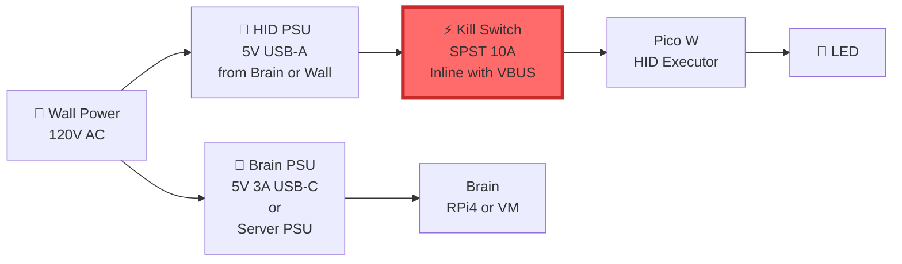

# Hardware Architecture Diagram — HexForge PLA

**Purpose**: Visual representation of hardware components, connections, and trust boundaries.

---

## Physical Architecture

```mermaid
graph TB
    subgraph "OPERATOR CONTROL"
        OP[👤 Operator]
        KS[⚡ Physical Kill Switch<br/>SPST 10A Toggle]
    end
    
    subgraph "BRAIN - Trusted Computing"
        BRAIN[🧠 Brain<br/>Proxmox VM or RPi4<br/>4GB RAM, 2 vCPU<br/>Python 3.11+]
        CAM[📷 USB Webcam<br/>Logitech C920/C922<br/>1080p @ 30fps]
        
        BRAIN_SUB[Subsystems:<br/>• AI Engine (Ollama)<br/>• Vision Pipeline (OpenCV + Tesseract)<br/>• Web UI (Flask)<br/>• Contract Validator<br/>• Session Logger]
    end
    
    subgraph "HANDS - Constrained Execution"
        PICO[🎮 Pico W HID Executor<br/>RP2040 @ 133MHz<br/>264KB RAM<br/>CircuitPython 8.x]
        LED[🔴 HID Armed LED<br/>5mm Red + 330Ω]
    end
    
    subgraph "OPTIONAL - Status Display"
        EINK[📟 E-ink Display<br/>Waveshare 2.13"<br/>I2C/SPI]
    end
    
    subgraph "TARGET SYSTEM"
        TARGET[💻 Target Machine<br/>Sandbox VM<br/>Test Laptop<br/>Operator-owned only]
    end
    
    %% Operator control paths
    OP -->|Approve/Deny Actions| BRAIN
    OP -->|Emergency Stop| KS
    KS -.->|Power Control<br/>VBUS Interrupt| PICO
    
    %% Brain connections
    CAM -->|USB 3.0<br/>Video Stream| BRAIN
    BRAIN -->|USB Serial<br/>115200 baud<br/>JSON Commands| PICO
    BRAIN -.->|I2C/SPI<br/>Status Updates| EINK
    
    %% HID execution
    PICO -->|GPIO 2<br/>Active High| LED
    PICO -->|USB HID<br/>Keyboard/Mouse| TARGET
    
    %% Feedback loop
    TARGET -.->|Screen Changes<br/>Captured by Camera| CAM
    
    %% Styling
    classDef trusted fill:#90EE90,stroke:#2d5016,stroke-width:3px
    classDef constrained fill:#FFB6C1,stroke:#8b0000,stroke-width:3px
    classDef control fill:#87CEEB,stroke:#00008b,stroke-width:3px
    classDef optional fill:#FFE4B5,stroke:#8b4513,stroke-width:2px,stroke-dasharray: 5 5
    
    class BRAIN,CAM,BRAIN_SUB trusted
    class PICO,LED constrained
    class OP,KS control
    class EINK optional
```

---

## Component Details

### Brain (Trusted Computing Zone)

**Option A: Proxmox VM** (Recommended for Lab)
```
Hardware: Existing server
Resources: 2 vCPU, 4GB RAM, 20GB disk
OS: Ubuntu Server 22.04 LTS
Runtime: Python 3.11+, Ollama, Docker (optional)
Network: Bridged (for web UI access)
USB Passthrough: PCI USB controller for camera
```

**Option B: Raspberry Pi 4**
```
Hardware: RPi4 4GB or 8GB
OS: Raspberry Pi OS (64-bit) or Ubuntu Server
Runtime: Python 3.11+, Ollama (if RAM permits)
Power: 5V 3A USB-C (UL listed)
Cooling: Active fan or passive heatsink
Storage: 64GB+ microSD (Class 10/A2)
```

**Interfaces**:
- USB 3.0 → Camera (video capture)
- USB 2.0 → HID Executor (serial commands)
- Ethernet/WiFi → Operator (web UI access)
- Optional I2C/SPI → E-ink display

---

### HID Executor (Constrained Execution Zone)

**Hardware: Raspberry Pi Pico W**
```
MCU: RP2040 dual-core ARM Cortex-M0+ @ 133MHz
RAM: 264KB SRAM
Storage: 2MB flash
GPIO: 26 pins (3.3V logic)
USB: Micro-USB (HID + serial)
WiFi: 802.11n (optional, not used in v1)
Power: 5V via USB (300mA typical)
```

**Firmware**: CircuitPython 8.x
- Lightweight, no OS overhead
- USB HID support (adafruit_hid)
- JSON parsing (built-in)
- Contract validation (lightweight)

**Interfaces**:
- USB Serial → Brain (command reception)
- USB HID → Target (keyboard/mouse)
- GPIO 2 → LED indicator (active high)
- VBUS → Kill switch (power control)

**Safety Hardware**:
- Kill switch inline with VBUS (cannot be bypassed)
- LED indicator (visible when HID armed)
- No battery (depends on USB power)

---

### Camera (Vision Input)

**Recommended: Logitech C920/C922**
```
Resolution: 1920x1080 @ 30fps
Field of View: 78° diagonal
Focus: Autofocus
Mount: 1/4"-20 tripod thread
Interface: USB 3.0 (Type-A)
Cable Length: 5-6 feet (extend with active cable if needed)
```

**Alternative: HDMI Capture Device**
```
Use Case: Clean digital capture (no reflections)
Device: USB HDMI capture dongle
Input: HDMI from target machine
Output: USB video device (/dev/video0)
Latency: < 50ms preferred
```

**Mounting**:
- Adjustable arm or tripod
- Position to capture target screen
- Avoid glare/reflections (use polarizing filter if needed)

---

### Optional: E-ink Status Display

**Purpose**: Real-time mode/status indicator visible to operator

**Recommended: Waveshare 2.13" E-ink**
```
Size: 2.13 inches (250x122 px)
Interface: SPI (4-wire)
Controller: Built-in (IL0373/SSD1680)
Power: 3.3V (from Pi GPIO)
Refresh: ~2 seconds (full), ~500ms (partial)
```

**Display Content**:
```
┌─────────────────────────┐
│ HexForge PLA            │
│ Mode: EXECUTE           │
│ Status: Active          │
│ HID: ARMED 🔴          │
│ Kill Switch: ON         │
│ Last Action: 00:12:34   │
└─────────────────────────┘
```

**Connection**:
- SPI0 (MOSI, MISO, SCLK, CE0)
- GPIO for DC, RST, BUSY pins
- Can connect to Brain (RPi4) or dedicated controller

---

## Power Architecture



**Kill Switch Requirements**:
- Type: SPST (Single Pole Single Throw) toggle switch
- Rating: 10A @ 125V AC (oversized for safety)
- Position: Inline with VBUS (USB power to Pico W)
- Effect: Completely removes power to HID executor
- Cannot be bypassed in firmware or software

---

## Communication Protocols

### Brain ↔ HID Executor

**Physical**: USB 2.0 (Micro-USB on Pico W)

**Logical**: USB Serial (CDC)
```
Baud Rate: 115200
Data Bits: 8
Parity: None
Stop Bits: 1
Flow Control: None
```

**Protocol**: JSON (newline-delimited)
```json
// Brain → HID (execute command)
{
  "command_id": "cmd-001",
  "timestamp": "2026-01-01T10:30:00Z",
  "mode": "EXECUTE",
  "action_type": "TYPE_TEXT",
  "payload": {"text": "username"},
  "operator_approval": {"operator_id": "op-001"},
  "safety_bounds": {"max_text_length": 1024, "min_action_delay_ms": 100}
}

// HID → Brain (status response)
{
  "device_id": "pico-w-001",
  "timestamp": "2026-01-01T10:30:00Z",
  "mode": "EXECUTE",
  "led_state": "ON",
  "kill_switch_state": "ARMED",
  "last_command_id": "cmd-001"
}
```

**Contract Validation**: Both sides validate messages against JSON schemas

---

### Brain ↔ Camera

**Physical**: USB 3.0 (Type-A)

**Logical**: V4L2 (Video4Linux2)
```
Device: /dev/video0
Resolution: 1920x1080
Frame Rate: 30 fps
Format: MJPEG or YUYV
Buffer: 2-4 frames
```

**Software**: OpenCV `cv2.VideoCapture()`

---

### Brain ↔ Web UI (Operator)

**Physical**: Ethernet or WiFi

**Logical**: HTTP/WebSocket
```
Web Server: Flask/FastAPI
Port: 5000 (HTTP) or 443 (HTTPS)
Protocol: WebSocket (real-time updates)
Authentication: Session-based (not security-critical)
```

**Contracts**: JSON (action_proposal, action_decision)

---

### Brain ↔ E-ink Display (Optional)

**Physical**: I2C or SPI

**I2C Example**:
```
Bus: I2C1 (RPi GPIO 2 SDA, GPIO 3 SCL)
Address: 0x3C (typical for OLED, varies for e-ink)
Speed: 400 kHz (fast mode)
```

**SPI Example**:
```
Bus: SPI0
MOSI: GPIO 10
MISO: GPIO 9 (usually not used for display)
SCLK: GPIO 11
CE0: GPIO 8
DC: GPIO 24 (data/command select)
RST: GPIO 25 (reset)
BUSY: GPIO 23 (busy signal from display)
```

---

## Wiring Diagram: Kill Switch

```
                     ┌──────────────┐
Wall Power ────►     │  USB Power   │
(5V Adapter)         │  Adapter     │
                     └──────┬───────┘
                            │
                            │ VBUS (5V)
                            │
                     ┌──────▼───────┐
                     │ Kill Switch  │ ◄─── Operator Control
                     │  SPST 10A    │
                     │              │
                     │  ON:  Armed  │
                     │  OFF: Safe   │
                     └──────┬───────┘
                            │
                            │ VBUS (5V, switched)
                            │
                     ┌──────▼────────────┐
                     │  Raspberry Pi     │
                     │  Pico W           │
                     │  (HID Executor)   │
                     │                   │
                     │  GPIO 2 ──► LED   │ 🔴
                     │                   │
                     │  USB HID ──► PC   │ 💻
                     └───────────────────┘
```

**Notes**:
- Kill switch MUST be inline with VBUS (not GPIO)
- When OFF: Pico W has no power, HID execution impossible
- When ON: Pico W boots, LED indicates mode
- Switch is physical failsafe (firmware cannot bypass)

---

## Wiring Diagram: Full System

```
┌─────────────────────────────────────────────────────────────┐
│  BRAIN (Proxmox VM or Raspberry Pi 4)                       │
│                                                              │
│  ┌──────────┐  ┌──────────┐  ┌──────────┐  ┌──────────┐   │
│  │ AI Engine│  │  Vision  │  │  Web UI  │  │  Logger  │   │
│  │ (Ollama) │  │(OpenCV)  │  │ (Flask)  │  │ (JSON)   │   │
│  └──────────┘  └─────┬────┘  └────┬─────┘  └──────────┘   │
│                      │             │                        │
│  ┌───────────────────┼─────────────┼────────────────────┐  │
│  │  USB3.0           │  Ethernet   │  USB2.0            │  │
└──┼───────────────────┼─────────────┼────────────────────┼──┘
   │                   │             │                    │
   │                   │             │                    │
┌──▼──────────┐   ┌───▼────┐   ┌───▼────────────────────▼──┐
│  USB Webcam │   │ Network│   │  Pico W HID Executor      │
│  (Logitech) │   │  Switch│   │  ┌─────────────────────┐  │
│             │   │  or    │   │  │ main.py             │  │
│ 1080p @ 30  │   │  WiFi  │   │  │ contract_validator  │  │
│             │   │  Router│   │  └─────────────────────┘  │
└─────────────┘   └───┬────┘   │                           │
                      │        │  GPIO 2 ──► 🔴 LED        │
                      │        │  USB HID ──► 💻 Target    │
                      │        └───────────────────────────┘
                      │                     ▲
                 ┌────▼────┐                │
                 │ Operator│                │
                 │ Laptop/ │         ⚡ Kill Switch
                 │ Browser │         (VBUS Control)
                 └─────────┘
```

---

## Physical Layout (Portable Configuration)

```
┌─────────────────────────────────────────┐
│  Portable Case (Pelican 1200 or similar)│
│                                         │
│  ┌─────────────────┐   ┌─────────────┐ │
│  │  Raspberry Pi 4 │   │  USB Power  │ │
│  │  (Brain)        │   │  Bank       │ │
│  │  + Heatsink     │   │  (optional) │ │
│  └────────┬────────┘   └─────────────┘ │
│           │                             │
│  ┌────────▼────────┐   ┌─────────────┐ │
│  │  Pico W         │   │ Kill Switch │ │
│  │  HID Executor   │   │  🔴 LED     │ │
│  │  + Breadboard   │   │  (visible)  │ │
│  └─────────────────┘   └─────────────┘ │
│                                         │
│  ┌─────────────────┐   ┌─────────────┐ │
│  │  USB Webcam     │   │  E-ink      │ │
│  │  on Arm/Tripod  │   │  Display    │ │
│  │  (points out)   │   │  (optional) │ │
│  └─────────────────┘   └─────────────┘ │
│                                         │
│  Cable Management: Velcro straps       │
│  Power: 1-2 wall adapters or battery   │
└─────────────────────────────────────────┘
```

---

## Trust Boundary Mapping

```
┌──────────────────────────────────────────────────────┐
│  UNTRUSTED                                           │
│  - Target Machine (sandbox VM)                       │
│  - Camera feed (may contain sensitive info)          │
└─────────────────┬────────────────────────────────────┘
                  │
                  │ (One-way: observation only)
                  │
┌─────────────────▼────────────────────────────────────┐
│  TRUSTED (Brain)                                     │
│  - AI reasoning                                      │
│  - Proposal generation                               │
│  - Session logging                                   │
│  - Contract validation                               │
└─────────────────┬────────────────────────────────────┘
                  │
                  │ (Approval gate: operator control)
                  │
┌─────────────────▼────────────────────────────────────┐
│  CONSTRAINED (HID Executor)                          │
│  - Bounded commands only                             │
│  - No reasoning or autonomy                          │
│  - Rate limited                                      │
│  - Kill switch override                              │
└─────────────────┬────────────────────────────────────┘
                  │
                  │ (USB HID: one-way execution)
                  │
┌─────────────────▼────────────────────────────────────┐
│  TARGET                                              │
│  - Receives HID input                                │
│  - No data sent back to PLA                          │
│  - Operator-owned machines only                      │
└──────────────────────────────────────────────────────┘
```

---

## Hardware Interfaces Summary

| Interface | Physical | Logical | Direction | Purpose |
|-----------|----------|---------|-----------|---------|
| Brain ↔ Camera | USB 3.0 Type-A | V4L2 | Camera → Brain | Video capture |
| Brain ↔ HID | USB 2.0 Micro | Serial (115200) | Bidirectional | Commands + status |
| Brain ↔ Operator | Ethernet/WiFi | HTTP/WebSocket | Bidirectional | Control + monitoring |
| Brain ↔ E-ink | I2C or SPI | Custom | Brain → Display | Status updates |
| HID ↔ Target | USB 2.0 Type-A | HID (keyboard/mouse) | HID → Target | Action execution |
| HID ↔ LED | GPIO 2 | Digital high/low | HID → LED | Visual indicator |
| Kill Switch ↔ HID | VBUS interrupt | Power on/off | Operator → HID | Safety override |

---

**Last Updated**: 2026-01-01  
**Next Review**: After hardware assembly and initial testing
