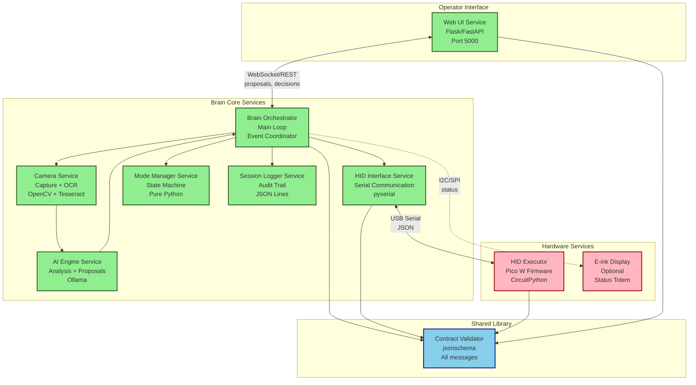

# Service & Module Architecture — HexForge PLA

**Purpose**: Define clean boundaries for services and modules to enable independent development, testing, and deployment.

**Philosophy**: Loosely coupled services communicating via well-defined contracts.

---

## Service Architecture Overview



---

## Service Definitions

### 1. Brain Orchestrator (Core)

**Purpose**: Main event loop coordinating all services

**Location**: `software/brain/src/main.py`

**Responsibilities**:
- Initialize all services on startup
- Coordinate event flow: camera → AI → proposals → operator → HID
- Handle mode transitions (OBSERVE → SUGGEST → EXECUTE)
- Graceful shutdown and error recovery
- Signal handling (SIGINT, SIGTERM)

**Dependencies**:
- Camera Service
- AI Engine Service
- HID Interface Service
- Mode Manager Service
- Session Logger Service
- Web UI Service (via WebSocket)

**Configuration**:
```yaml
# config/brain_config.yaml
system:
  mode: observe  # Default mode
  log_level: INFO
  log_file: /var/log/hexforge-pla/brain.log
  
services:
  camera:
    enabled: true
    device: /dev/video0
  
  ai_engine:
    enabled: true
    model: llama2:7b-chat
  
  hid_interface:
    enabled: true
    serial_port: /dev/ttyACM0
  
  web_ui:
    enabled: true
    port: 5000
```

**API** (Internal):
```python
class BrainOrchestrator:
    def __init__(self, config: Dict):
        """Initialize orchestrator with config."""
    
    def start(self):
        """Start main event loop."""
    
    def stop(self):
        """Graceful shutdown."""
    
    def handle_mode_change(self, new_mode: str):
        """Transition to new mode."""
    
    def handle_proposal(self, proposal: Dict):
        """Process AI proposal."""
    
    def handle_decision(self, decision: Dict):
        """Process operator decision."""
```

**Status**: 🚧 Scaffolding only (115 lines placeholder)

**Estimated Effort**: 300-400 lines when fully implemented

---

### 2. Camera Service

**Purpose**: Capture frames and extract text via OCR

**Location**: `software/brain/src/camera/` (new module)

**Responsibilities**:
- Open video device (/dev/video0)
- Capture frames at specified rate (default 1 fps)
- Preprocess frames (crop, resize, enhance)
- Run Tesseract OCR on frames
- Provide frame and OCR text to AI Engine
- Handle camera disconnection gracefully

**Dependencies**:
- OpenCV (cv2)
- Tesseract (pytesseract)
- NumPy (for image processing)

**Configuration**:
```yaml
# config/camera_config.yaml
device: /dev/video0
resolution:
  width: 1920
  height: 1080
frame_rate: 1  # fps (for OBSERVE mode, increase for EXECUTE)
ocr:
  enabled: true
  language: eng
  config: --psm 3  # Page segmentation mode
preprocessing:
  crop:
    enabled: false
    x: 0
    y: 0
    width: 1920
    height: 1080
  grayscale: true
  denoise: true
```

**API**:
```python
class CameraService:
    def __init__(self, config: Dict):
        """Initialize camera with config."""
    
    def start(self):
        """Open camera device."""
    
    def stop(self):
        """Release camera device."""
    
    def capture_frame(self) -> np.ndarray:
        """Capture single frame. Returns numpy array (BGR)."""
    
    def extract_text(self, frame: np.ndarray) -> str:
        """Run OCR on frame. Returns extracted text."""
    
    def capture_and_ocr(self) -> Tuple[np.ndarray, str]:
        """Convenience method: capture + OCR."""
    
    def is_connected(self) -> bool:
        """Check if camera is connected."""
```

**Status**: ❌ Not started

**Estimated Effort**: 200-300 lines

**Testing Strategy**:
- Unit tests with mock camera (pre-recorded frames)
- Integration tests with real camera (requires hardware)
- OCR accuracy tests with known text samples

---

### 3. AI Engine Service

**Purpose**: Analyze screen state and generate action proposals

**Location**: `software/brain/src/ai_engine/` (new module)

**Responsibilities**:
- Receive OCR text + frame context from Camera Service
- Send prompt to Ollama (llama2:7b-chat or similar)
- Parse AI response into structured action proposals
- Detect credentials (passwords, API keys) in OCR text
- Set `credential_warning` flag if detected
- Generate rationale for each proposed action
- Rate limit AI requests to avoid overload

**Dependencies**:
- Ollama (via HTTP API or Python SDK)
- Contract Validator (to validate proposals)
- Regular expressions (for credential detection)

**Configuration**:
```yaml
# config/ai_config.yaml
model: llama2:7b-chat
ollama:
  host: http://localhost:11434
  timeout: 30  # seconds
  
prompts:
  system: |
    You are a lab assistant helping an operator interact with a computer.
    Your role is to observe the screen and suggest keyboard/mouse actions.
    Always be cautious and explain your reasoning.
  
credential_detection:
  enabled: true
  patterns:
    - "password[:\\s]*\\S+"
    - "api[_\\s]?key[:\\s]*\\S+"
    - "[Aa]ccess[_\\s]?[Tt]oken[:\\s]*\\S+"
    - "AWS[A-Z0-9]{16,}"
  
rate_limit:
  max_requests_per_minute: 10
```

**API**:
```python
class AIEngine:
    def __init__(self, config: Dict):
        """Initialize AI engine with config."""
    
    def analyze_screen(self, ocr_text: str, frame: np.ndarray, mode: str) -> Dict:
        """
        Analyze screen and generate proposal.
        
        Args:
            ocr_text: Text extracted from screen
            frame: Raw frame (for visual context, optional)
            mode: Current system mode
        
        Returns:
            Proposal dict (action_proposal.schema.json)
        """
    
    def detect_credentials(self, text: str) -> bool:
        """Check if text contains credentials/secrets."""
    
    def generate_rationale(self, action: Dict, context: str) -> str:
        """Generate human-readable rationale for action."""
    
    def is_available(self) -> bool:
        """Check if Ollama is running and responding."""
```

**Status**: ❌ Not started

**Estimated Effort**: 300-400 lines

**Testing Strategy**:
- Unit tests with mock Ollama responses
- Integration tests with real Ollama
- Credential detection tests with known patterns
- Rationale quality evaluation (manual review)

---

### 4. HID Interface Service

**Purpose**: Serial communication with HID Executor (Pico W)

**Location**: `software/brain/src/hid_interface/` (new module)

**Responsibilities**:
- Open serial connection to HID Executor (/dev/ttyACM0)
- Send execute commands (JSON)
- Receive device status updates (JSON)
- Validate contracts before sending
- Handle serial disconnection (kill switch, USB unplug)
- Retry logic for transient errors
- Queue commands if HID is busy

**Dependencies**:
- pyserial
- Contract Validator

**Configuration**:
```yaml
# config/hid_config.yaml
serial:
  port: /dev/ttyACM0
  baud_rate: 115200
  timeout: 2  # seconds
  
communication:
  retry_attempts: 3
  retry_delay: 1  # seconds
  command_queue_size: 10
  
safety:
  validate_contracts: true
  require_operator_approval: true
```

**API**:
```python
class HIDInterface:
    def __init__(self, config: Dict):
        """Initialize HID interface with config."""
    
    def connect(self):
        """Open serial connection to HID Executor."""
    
    def disconnect(self):
        """Close serial connection."""
    
    def send_command(self, command: Dict) -> Dict:
        """
        Send execute command to HID Executor.
        
        Args:
            command: action_execute.schema.json compliant dict
        
        Returns:
            Response from HID Executor
        """
    
    def get_status(self) -> Dict:
        """
        Request device status from HID Executor.
        
        Returns:
            device_status.schema.json compliant dict
        """
    
    def is_connected(self) -> bool:
        """Check if HID Executor is connected."""
    
    def set_mode(self, mode: str):
        """Send mode change command to HID Executor."""
```

**Status**: ❌ Not started

**Estimated Effort**: 150-200 lines

**Testing Strategy**:
- Unit tests with mock serial (pyvirtualserial or similar)
- Integration tests with real HID Executor
- Error recovery tests (disconnect/reconnect)
- Contract validation tests (invalid commands rejected)

---

### 5. Mode Manager Service

**Purpose**: State machine for mode transitions

**Location**: `software/brain/src/mode_manager/` (new module)

**Responsibilities**:
- Maintain current mode state (OBSERVE, SUGGEST, EXECUTE)
- Validate mode transitions (e.g., OBSERVE → SUGGEST is valid)
- Enforce mode constraints (e.g., HID only in EXECUTE)
- Broadcast mode change events to all services
- Persist mode across restarts (optional)

**Dependencies**:
- None (pure logic, no external dependencies)

**Configuration**:
```yaml
# config/mode_config.yaml
default_mode: observe
allowed_transitions:
  observe:
    - suggest
  suggest:
    - observe
    - execute
  execute:
    - observe
```

**API**:
```python
class ModeManager:
    def __init__(self, config: Dict):
        """Initialize mode manager with config."""
    
    def get_mode(self) -> str:
        """Get current mode."""
    
    def set_mode(self, new_mode: str) -> bool:
        """
        Transition to new mode.
        
        Args:
            new_mode: Target mode (OBSERVE, SUGGEST, EXECUTE)
        
        Returns:
            True if transition successful, False if invalid
        """
    
    def is_transition_valid(self, from_mode: str, to_mode: str) -> bool:
        """Check if transition is allowed."""
    
    def register_callback(self, callback: Callable):
        """Register callback for mode change events."""
```

**Status**: ❌ Not started

**Estimated Effort**: 100-150 lines

**Testing Strategy**:
- Unit tests for all valid transitions
- Unit tests for invalid transitions (should fail)
- Event notification tests (callbacks invoked)

---

### 6. Session Logger Service

**Purpose**: Immutable audit trail with tamper detection

**Location**: `software/brain/src/session_logger/` (new module)

**Responsibilities**:
- Log all events to append-only file
- Generate checksums for tamper detection
- Implement checksum chaining (each log references previous)
- Validate contracts before logging
- Rotate log files (daily or size-based)
- Provide read-only access to logs (for UI)

**Dependencies**:
- hashlib (stdlib, for checksums)
- Contract Validator

**Configuration**:
```yaml
# config/logger_config.yaml
log_directory: /var/log/hexforge-pla/sessions
rotation:
  strategy: daily  # or size
  max_size: 100MB
  keep_days: 90
checksum:
  algorithm: sha256
  chain_enabled: true
```

**API**:
```python
class SessionLogger:
    def __init__(self, config: Dict):
        """Initialize session logger with config."""
    
    def start_session(self, session_id: str):
        """Start new session log file."""
    
    def log_event(self, event: Dict):
        """
        Log event to session file.
        
        Args:
            event: session_log.schema.json compliant dict
        """
    
    def end_session(self):
        """Close current session log file."""
    
    def get_session_log(self, session_id: str) -> List[Dict]:
        """Read session log (for UI display)."""
    
    def verify_integrity(self, session_id: str) -> bool:
        """Verify checksum chain integrity."""
```

**Status**: ❌ Not started

**Estimated Effort**: 150-200 lines

**Testing Strategy**:
- Unit tests for log writing
- Unit tests for checksum calculation
- Tamper detection tests (modify log, verify fails)
- Log rotation tests

---

### 7. Web UI Service

**Purpose**: Operator control panel and monitoring

**Location**: `software/brain/ui/` (new module)

**Responsibilities**:
- Serve web interface (HTML/CSS/JavaScript)
- Display action proposals
- Accept operator approvals/rejections
- Show session log in real-time
- Provide mode switcher (OBSERVE/SUGGEST/EXECUTE)
- Stream camera feed (optional)
- WebSocket for real-time updates

**Dependencies**:
- Flask or FastAPI (web framework)
- WebSockets (flask-socketio or fastapi-websockets)
- Contract Validator

**Configuration**:
```yaml
# config/ui_config.yaml
server:
  host: 0.0.0.0  # Listen on all interfaces
  port: 5000
  debug: false
  
features:
  camera_stream: false  # Performance impact
  session_log_viewer: true
  mode_switcher: true
  
security:
  auth_enabled: false  # Not security-critical (internal lab)
  session_timeout: 3600  # seconds
```

**API** (REST + WebSocket):
```
REST Endpoints:
  GET  /api/status          - System status
  GET  /api/mode            - Current mode
  POST /api/mode            - Change mode
  GET  /api/proposals       - List pending proposals
  POST /api/proposals/{id}  - Approve/reject proposal
  GET  /api/sessions        - List session logs
  GET  /api/sessions/{id}   - Get session log

WebSocket Events:
  server → client:
    - proposal_created    (new AI proposal)
    - action_executed     (HID executed action)
    - mode_changed        (system mode changed)
    - device_status       (HID status update)
  
  client → server:
    - approve_proposal    (operator approves)
    - reject_proposal     (operator rejects)
    - change_mode         (operator changes mode)
```

**Status**: ❌ Not started

**Estimated Effort**: 500-700 lines (backend + frontend)

**Testing Strategy**:
- Backend API tests (pytest)
- Frontend tests (playwright or selenium)
- WebSocket tests (real-time events)
- UI/UX testing (manual)

---

## Hardware Services

### 8. HID Executor Firmware

**Purpose**: Bounded keyboard/mouse executor with safety

**Location**: `hardware/pico-hid-executor/` (existing)

**Responsibilities**:
- Receive execute commands via USB serial
- Validate contracts (lightweight)
- Execute HID actions (keyboard/mouse)
- Enforce safety bounds (max text, rate limiting)
- Report device status to Brain
- Update LED indicator (mode-based)
- Respect kill switch (power control)

**Dependencies**:
- CircuitPython 8.x
- adafruit_hid library
- Contract validator (lightweight version)

**API** (Serial JSON):
```json
// Incoming commands
{
  "mode": "EXECUTE"  // Mode change
}

{
  "command_id": "...",
  "action_type": "TYPE_TEXT",
  "payload": {"text": "..."},
  ...
}

// Outgoing responses
{
  "status": "ok",
  "message": "Action executed"
}

{
  "device_id": "pico-w-001",
  "mode": "EXECUTE",
  "led_state": "ON",
  ...
}
```

**Status**: ✅ Functional (337 lines main.py, 130 lines validator)

**No changes needed** - firmware is production ready

---

### 9. E-ink Status Display (Optional)

**Purpose**: Real-time status indicator visible to operator

**Location**: `hardware/eink-status-totem/` (new)

**Responsibilities**:
- Display current mode (OBSERVE/SUGGEST/EXECUTE)
- Show last action timestamp
- Indicate kill switch state
- Show HID armed status (LED state)
- Update display when status changes

**Dependencies**:
- CircuitPython or MicroPython
- Waveshare e-ink driver (or similar)

**API** (I2C/SPI from Brain):
```python
# Simple status message (no contracts, hardware-specific)
{
  "mode": "EXECUTE",
  "hid_armed": True,
  "kill_switch": "ON",
  "last_action": "2026-01-01T10:30:00Z"
}
```

**Status**: 📋 Planned (optional, not critical for MVP)

**Estimated Effort**: 150-200 lines

**Testing Strategy**:
- Display rendering tests
- I2C/SPI communication tests
- Refresh rate tests (partial vs full refresh)

---

## Shared Library

### 10. Contract Validator

**Purpose**: JSON schema validation for all messages

**Location**: `software/brain/src/contract_validator.py` (existing)

**Responsibilities**:
- Load all JSON schemas (7 schemas: 5 PLA + 2 global)
- Validate data against schemas
- Provide clear error messages
- Support both Brain (full validation) and HID (lightweight)

**Dependencies**:
- jsonschema (Brain only)
- Pure Python logic (HID lightweight version)

**API**:
```python
# Brain version (full)
from contract_validator import (
    validate_proposal,
    validate_decision,
    validate_execute,
    validate_session_log,
    validate_device_status,
    validate_job_status,
    validate_job_manifest
)

is_valid, error_msg = validate_proposal(data)

# HID version (lightweight)
from contract_validator import (
    validate_execute_command,
    validate_device_status
)

is_valid, error_msg = validate_execute_command(data)
```

**Status**: ✅ Complete (225 lines Brain, 130 lines HID)

**Tests**: 15/15 passing ✅

---

## Service Communication Patterns

### Synchronous (Function Calls)

Used within Brain services (same process):

```python
# Brain orchestrator calls services directly
frame = camera_service.capture_frame()
text = camera_service.extract_text(frame)
proposal = ai_engine.analyze_screen(text, frame, mode)
session_logger.log_event({"type": "PROPOSAL", "data": proposal})
```

**Pros**: Simple, low latency, easy to debug
**Cons**: Tight coupling within Brain process

---

### Message-Based (JSON over Serial)

Used for Brain ↔ HID Executor:

```python
# Brain sends command to HID
command = {
    "command_id": "cmd-001",
    "action_type": "TYPE_TEXT",
    "payload": {"text": "username"},
    ...
}
response = hid_interface.send_command(command)
```

**Pros**: Loose coupling, contract-validated, testable
**Cons**: Serial overhead (~10ms latency)

---

### WebSocket (Real-time)

Used for Brain ↔ Web UI:

```javascript
// Client receives proposal
socket.on('proposal_created', (proposal) => {
  displayProposal(proposal);
});

// Client sends approval
socket.emit('approve_proposal', {
  proposal_id: 'prop-001',
  operator_id: 'op-001'
});
```

**Pros**: Real-time updates, bidirectional, efficient
**Cons**: Requires persistent connection

---

## Deployment Architecture

### Development (Local)

```
┌─────────────────────────────────┐
│  Developer Laptop               │
│                                 │
│  ┌─────────────────────────┐   │
│  │  Brain (Python venv)    │   │
│  │  - All services         │   │
│  │  - Ollama local         │   │
│  │  - Web UI (port 5000)   │   │
│  └───────┬─────────────────┘   │
│          │                      │
│  ┌───────▼─────────────────┐   │
│  │  HID Executor           │   │
│  │  (Pico W USB)           │   │
│  └─────────────────────────┘   │
│                                 │
│  ┌─────────────────────────┐   │
│  │  Camera (USB)           │   │
│  └─────────────────────────┘   │
└─────────────────────────────────┘
```

**Usage**: Development, testing, debugging
**Setup**: `python3 src/main.py` in venv

---

### Production (Lab Setup)

**Option A: All-in-One (RPi4)**
```
┌─────────────────────────────────┐
│  Raspberry Pi 4 (Brain)         │
│  - OS: Raspberry Pi OS 64-bit   │
│  - Python 3.11+ venv            │
│  - Ollama (if RAM permits)      │
│  - Systemd service for Brain    │
│                                 │
│  USB Ports:                     │
│  - [USB 3.0] Camera             │
│  - [USB 2.0] HID Executor       │
│                                 │
│  Network:                       │
│  - Ethernet/WiFi for Web UI     │
└─────────────────────────────────┘
```

**Option B: Distributed (Proxmox VM + HID)**
```
┌─────────────────────────────────┐
│  Proxmox Server                 │
│                                 │
│  ┌─────────────────────────┐   │
│  │  Brain VM               │   │
│  │  - Ubuntu Server 22.04  │   │
│  │  - 2 vCPU, 4GB RAM      │   │
│  │  - Ollama               │   │
│  │  - Systemd services     │   │
│  │                         │   │
│  │  USB Passthrough:       │   │
│  │  - Camera               │   │
│  │  - HID Executor         │   │
│  └─────────────────────────┘   │
└─────────────────────────────────┘
```

**Deployment**:
1. Install dependencies: `pip install -r requirements.txt`
2. Configure: Edit `config/*.yaml`
3. Create systemd service:
   ```ini
   [Unit]
   Description=HexForge PLA Brain
   After=network.target
   
   [Service]
   User=pla
   WorkingDirectory=/opt/hexforge-pla
   ExecStart=/opt/hexforge-pla/software/brain/venv/bin/python3 src/main.py
   Restart=on-failure
   
   [Install]
   WantedBy=multi-user.target
   ```
4. Enable: `sudo systemctl enable hexforge-pla-brain`
5. Start: `sudo systemctl start hexforge-pla-brain`

---

## Service Isolation Benefits

### Independent Development
- Each service can be developed by different team members
- Clear interfaces (contracts) define expectations
- No need to understand entire codebase

### Independent Testing
- Unit tests per service (mock dependencies)
- Integration tests at service boundaries
- Easier to achieve high test coverage

### Independent Deployment
- Update one service without affecting others
- Roll back single service if issues arise
- Gradual feature rollout

### Scalability
- Future: Run AI Engine on separate GPU server
- Future: Distribute load across multiple Brain instances
- Current: All services in single process (simplicity)

---

## Migration Path

### Current State (v1.0.0)
```
software/brain/src/
├── main.py (scaffolding)
└── contract_validator.py (complete)
```

### Phase 1: Core Services (v1.1.0)
```
software/brain/src/
├── main.py (orchestrator)
├── contract_validator.py
├── camera/
│   ├── __init__.py
│   └── camera_service.py
├── hid_interface/
│   ├── __init__.py
│   └── hid_interface.py
└── mode_manager/
    ├── __init__.py
    └── mode_manager.py
```

### Phase 2: AI + Logging (v1.2.0)
```
software/brain/src/
├── ... (previous)
├── ai_engine/
│   ├── __init__.py
│   └── ai_engine.py
└── session_logger/
    ├── __init__.py
    └── session_logger.py
```

### Phase 3: Web UI (v2.0.0)
```
software/brain/
├── src/ (previous)
└── ui/
    ├── __init__.py
    ├── server.py
    ├── static/
    │   ├── css/
    │   ├── js/
    │   └── index.html
    └── templates/
```

---

## Service Status Summary

| Service | Location | Status | Lines | Dependencies |
|---------|----------|--------|-------|--------------|
| Brain Orchestrator | `src/main.py` | 🚧 Scaffold | 115 | All services |
| Camera Service | `src/camera/` | ❌ Missing | 0 | OpenCV, Tesseract |
| AI Engine | `src/ai_engine/` | ❌ Missing | 0 | Ollama |
| HID Interface | `src/hid_interface/` | ❌ Missing | 0 | pyserial |
| Mode Manager | `src/mode_manager/` | ❌ Missing | 0 | None |
| Session Logger | `src/session_logger/` | ❌ Missing | 0 | hashlib |
| Web UI | `ui/` | ❌ Missing | 0 | Flask/FastAPI |
| HID Executor | `hardware/pico-hid-executor/` | ✅ Complete | 467 | CircuitPython |
| E-ink Display | `hardware/eink-status-totem/` | 📋 Planned | 0 | Display driver |
| Contract Validator | `src/contract_validator.py` | ✅ Complete | 225 | jsonschema |

**Total Estimated Effort**: ~1800-2400 lines to complete all services

---

**Last Updated**: 2026-01-01  
**Next Review**: After first service implementation (Camera or HID Interface recommended)
